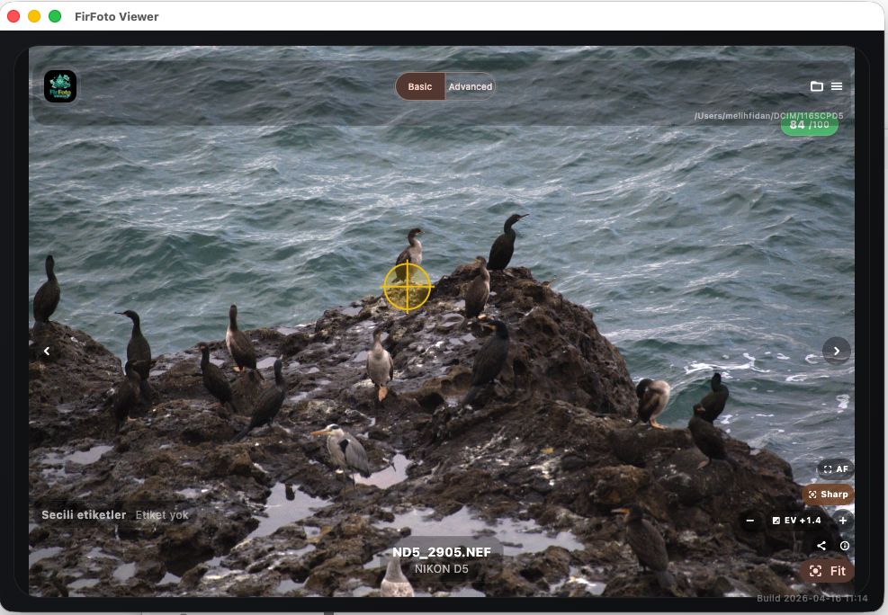
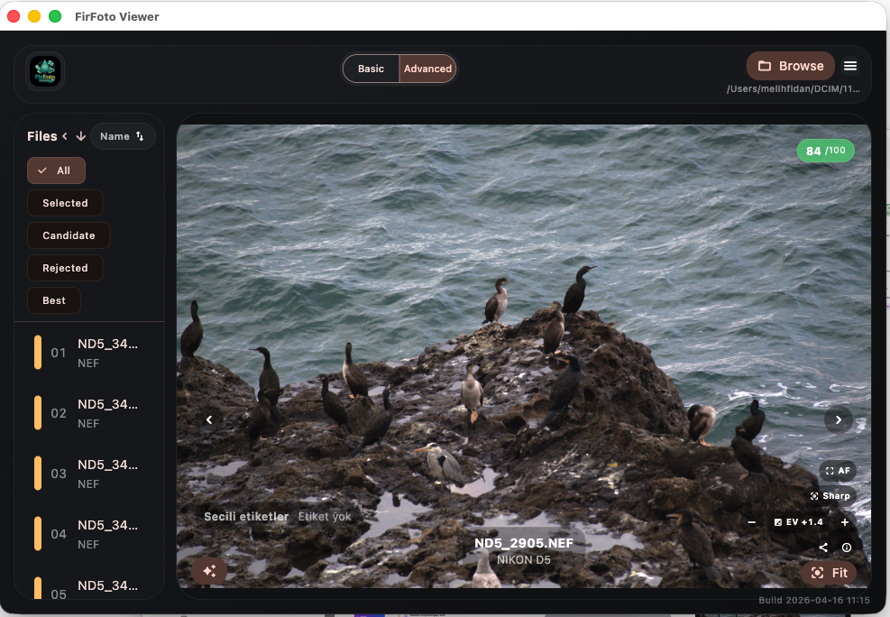

# FirFoto

Non-destructive, explainable photo culling assistant for large image sets and RAW-heavy workflows.

FirFoto combines a Python analysis pipeline with a desktop viewer focused on fast keep/reject review. The current repo includes the core scan/analyze CLI, a legacy Qt preview app, and an actively developed macOS Flutter viewer with Basic and Advanced review modes.

## What It Does

- Scans folders for supported photo files, including common RAW formats.
- Computes image quality signals such as sharpness, exposure, contrast, noise, and motion blur probability.
- Produces explainable decisions like `selected`, `candidate`, `rejected`, and `best_of_burst`.
- Keeps review non-destructive by storing analysis and feedback separately from the original files.
- Lets you review images visually with overlays such as AF regions, sharpness guess, zoom, fit, and exposure controls.

## Viewer Modes

### Basic

Basic mode keeps the UI minimal and photo-first. It is intended for quick browse, fit, zoom, navigation, and lightweight overlay use.

### Advanced

Advanced mode adds file filtering, sort controls, category/decision review, inspector details, and denser culling workflow tools while still prioritizing the active photo.

Advanced viewer snapshots:





Current Advanced workflow includes:

- Left-side file list with compact keep/reject filters.
- Sort controls for date, name, and extension.
- Exposure, AF, sharpness, fit, and info controls on the preview.
- Metadata and decision editing from the details drawer.

## Supported Formats

Common previewable formats:

- `jpg`
- `jpeg`
- `png`
- `tif`
- `tiff`
- `webp`

RAW-oriented formats currently recognized by the workflow:

- `nef`
- `dng`
- `cr2`
- `cr3`
- `arw`
- `raf`
- `orf`
- `rw2`

RAW previews are rendered through `rawpy` when available.

## Quick Start

### Python CLI

Create a local test environment and sample folder:

```sh
sh scripts/bootstrap_testbed.sh
```

Then activate the environment and run:

```sh
. .venv/bin/activate
firfoto scan testbed/photo_folder --recursive
firfoto analyze testbed/photo_folder --recursive --category bird --db testbed/firfoto.sqlite3 --json
firfoto gui testbed/photo_folder
```

### Flutter macOS Viewer

Run the current macOS viewer build:

```sh
./script/build_and_run.sh
```

Create a distributable DMG:

```sh
./script/package_dmg.sh
```

Generated artifact:

- `dist/FirFoto-Viewer.dmg`

## CLI Commands

FirFoto currently exposes these main commands:

- `firfoto scan`
- `firfoto analyze`
- `firfoto analyze-stream`
- `firfoto gui`

The CLI entry point is defined in [src/firfoto/cli.py](/Volumes/public/Firfoto/src/firfoto/cli.py:1).

## Repository Layout

- `src/firfoto`: Python package for scanning, analysis, config, and CLI.
- `src/firfoto/gui`: Legacy Qt preview UI and image helpers.
- `firfoto_viewer`: Flutter-based desktop viewer under active development.
- `docs/screenshots`: README assets and UI captures.
- `script`: local build, run, install, and DMG packaging scripts.
- `tests`: Python-side scaffold and GUI tests.

## Current Status

This repository is in active product-shaping mode. The desktop review workflow is already usable, but the UI, bundle metadata, packaging flow, and Advanced review ergonomics are still being refined.

If you are evaluating the project today, the best path is:

1. Use the CLI to scan/analyze a local folder.
2. Open the Flutter macOS viewer for review.
3. Package with the DMG script when you want to test installation behavior.

---

# FirFoto (TR)

Büyük görüntü setleri ve yoğun RAW iş akışları için tahribatsız (non-destructive), açıklanabilir fotoğraf ayıklama (culling) asistanı.

FirFoto, Python analiz boru hattı ile hızlı tut/at (keep/reject) incelemesine odaklanmış bir masaüstü görüntüleyiciyi birleştirir. Mevcut depo; çekirdek tarama/analiz CLI'sını, eski bir Qt önizleme uygulamasını ve Temel/Gelişmiş inceleme modlarına sahip, aktif olarak geliştirilen macOS Flutter görüntüleyicisini içerir.

## Ne Yapar?

- Desteklenen fotoğraf dosyaları için klasörleri tarar (yaygın RAW formatları dahil).
- Netlik, pozlama, kontrast, gürültü ve hareket bulanıklığı olasılığı gibi görüntü kalitesi sinyallerini hesaplar.
- `seçildi`, `aday`, `reddedildi` ve `burst'un_en_iyisi` gibi açıklanabilir kararlar üretir.
- Analiz ve geri bildirimleri orijinal dosyalardan ayrı saklayarak incelemeyi tahribatsız tutar.
- Görüntüleri AF bölgeleri, keskinlik tahmini, yakınlaştırma (zoom), sığdırma (fit) ve pozlama kontrolleri gibi katmanlarla görsel olarak incelemenizi sağlar.

## Görüntüleyici Modları

### Temel (Basic)

Temel mod, kullanıcı arayüzünü minimal ve fotoğraf odaklı tutar. Hızlı göz atma, sığdırma, yakınlaştırma, navigasyon ve hafif katman kullanımı için tasarlanmıştır.

### Gelişmiş (Advanced)

Gelişmiş mod; dosya filtreleme, sıralama kontrolleri, kategori/karar inceleme, müfettiş detayları ve yoğun ayıklama iş akışı araçlarını eklerken hala aktif fotoğrafı önceliklendirir.

Gelişmiş görüntüleyici ekran görüntüleri: İngilizce bölüme bakınız.

Gelişmiş iş akışı şunları içerir:
- Sol tarafta kompakt tut/at filtreli dosya listesi.
- Tarih, isim ve uzantıya göre sıralama kontrolleri.
- Önizleme üzerinde pozlama, AF, netlik, sığdırma ve bilgi kontrolleri.
- Detay panelinden meta veri ve karar düzenleme.

## Desteklenen Formatlar

Yaygın önizlenebilir formatlar:
- `jpg`, `jpeg`, `png`, `tif`, `tiff`, `webp`

İş akışı tarafından tanınan RAW odaklı formatlar:
- `nef`, `dng`, `cr2`, `cr3`, `arw`, `raf`, `orf`, `rw2`

RAW önizlemeleri, uygun olduğunda `rawpy` üzerinden işlenir.

## Hızlı Başlangıç

### Python CLI

Yerel bir test ortamı ve örnek klasör oluşturun:
```sh
sh scripts/bootstrap_testbed.sh
```
Ardından ortamı aktif edin ve çalıştırın:
```sh
. .venv/bin/activate
firfoto scan testbed/photo_folder --recursive
firfoto analyze testbed/photo_folder --recursive --category bird --db testbed/firfoto.sqlite3 --json
firfoto gui testbed/photo_folder
```

### Flutter macOS Görüntüleyici

Mevcut macOS görüntüleyici sürümünü çalıştırın:
```sh
./script/build_and_run.sh
```
Dağıtılabilir DMG oluşturun:
```sh
./script/package_dmg.sh
```
Oluşturulan araç:
- `dist/FirFoto-Viewer.dmg`

## Depo Düzeni

- `src/firfoto`: Tarama, analiz, yapılandırma ve CLI için Python paketi.
- `src/firfoto/gui`: Eski Qt önizleme arayüzü ve görüntü yardımcıları.
- `firfoto_viewer`: Aktif geliştirme aşamasındaki Flutter tabanlı masaüstü görüntüleyici.
- `docs/screenshots`: README varlıkları ve ekran görüntüleri.
- `script`: Yerel derleme, çalıştırma, kurulum ve DMG paketleme betikleri.
- `tests`: Python tarafı iskelet ve GUI testleri.

## Mevcut Durum

Bu depo aktif ürün şekillendirme modundadır. Masaüstü inceleme iş akışı halihazırda kullanılabilir durumdadır, ancak kullanıcı arayüzü, paket meta verileri, paketleme akışı ve Gelişmiş inceleme ergonomisi hala geliştirilmektedir.
